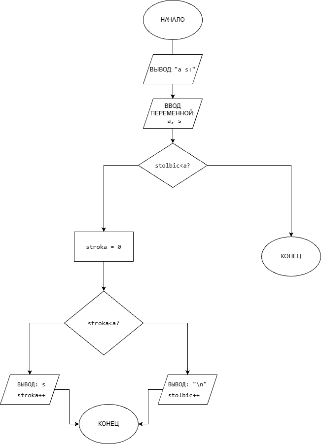

# Домашнее задание к работе 9
## Условие задачи
Написать программу, выводящую на экран закрашенный квадрат, нарисованный с помощью заданного с клавиатуры
символа.
### Алгоритм
1. Начало
2. Объявить константы:
   - а = переменная.
   - stolbic = переменная.
   - stroka = переменная.
   - s = переменная.
3. Считаем:
   - for (stolbic = 0; stolbic < a; stolbic++) {
     for (stroka = 0; stroka < a; stroka++)
5. Выводим результаты расчетов:
   - printf("%c", s);
   - printf("\n");
6. Конец
### Блок-схема

## 2. Реализация программы:
   #define _CRT_SECURE_NO_WARNINGS 
#define _USE_MATH_DEFINES 
#include <locale.h> 
#include <stdio.h> 

int main() {
    setlocale(LC_ALL, "RUS");
    int a, stolbic, stroka;
    char s;
    printf("a s:\n");
    scanf("%d %c", &a, &s);
    for (stolbic = 0; stolbic < a; stolbic++) {
        for (stroka = 0; stroka < a; stroka++)
            printf("%c", s);
        printf("\n");
    }
}
## 3. Результат работы программы

## 4. Информация о разработчике
Амелина Юлия, бИПТ-252
