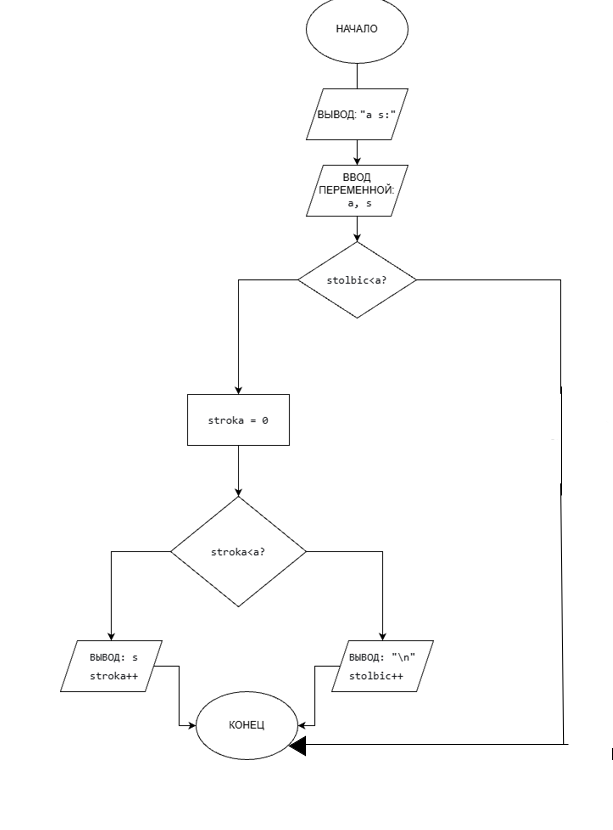
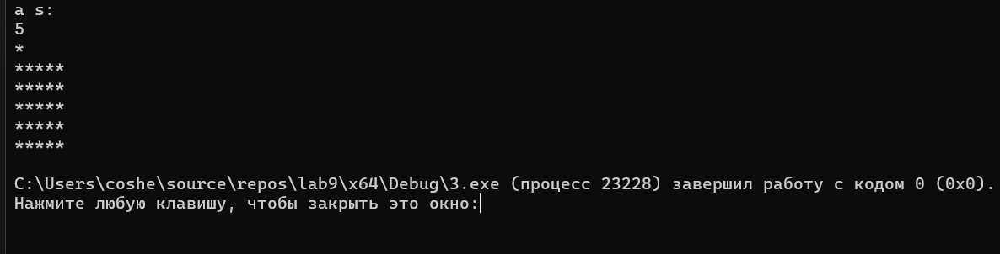

# Домашнее задание к работе 9
## Условие задачи
Напишите программу, которая вывыводит заполненный квадрат
### Алгоритм
1.Начало программы 
2.Объявить массив
- a = переменная.
- stolbic = переменная.
- stroka = переменная.
- s = переменная.
3.Вычислить
  for (stolbic = 0; stolbic < a; stolbic++) {
              for (stroka = 0; stroka < a; stroka++)
4.Вывести результат
   printf("%c", s);
              printf("\n");
5.Конец 
### Блок-схема

## 2. Реализация программы:
       #define _CRT_SECURE_NO_WARNINGS 
      #define _USE_MATH_DEFINES 
      #include <locale.h> 
      #include <stdio.h> 
      
      int main() {
          setlocale(LC_ALL, "RUS");
          int a, stolbic, stroka;
          char s;
          printf("a s:\n");
          scanf("%d %c", &a, &s);
          for (stolbic = 0; stolbic < a; stolbic++) {
              for (stroka = 0; stroka < a; stroka++)
                  printf("%c", s);
              printf("\n");
          }
      }
## 3. Результат работы программы

## 4. Информация о разработчике
Амелина Юлия, бИПТ-252
